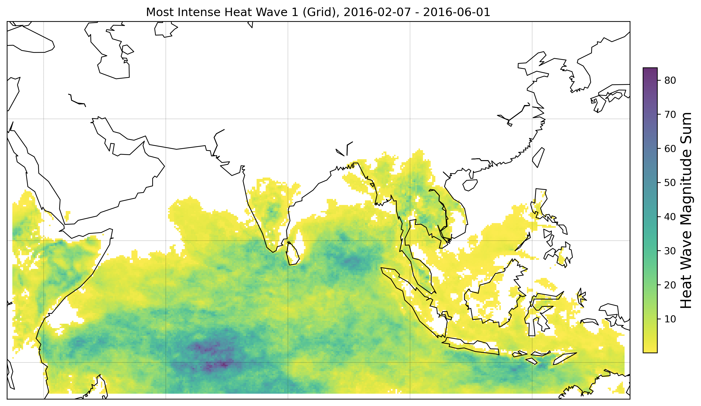
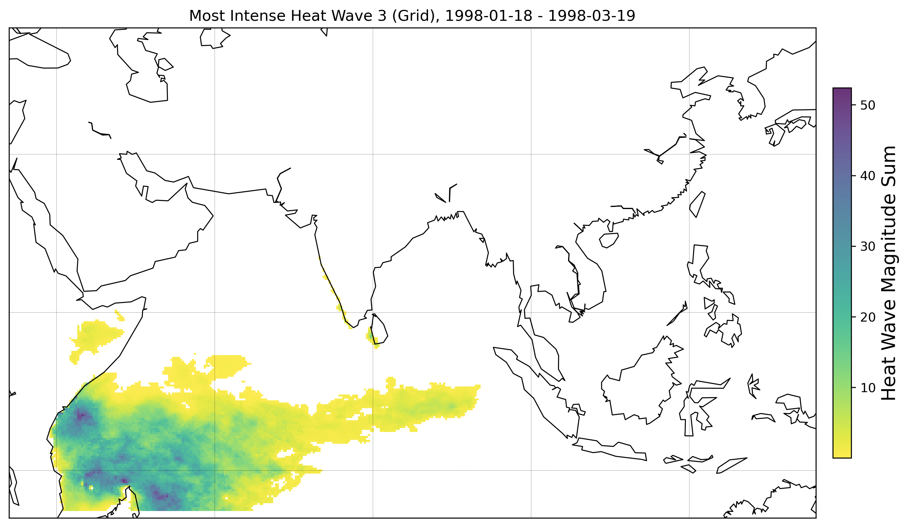
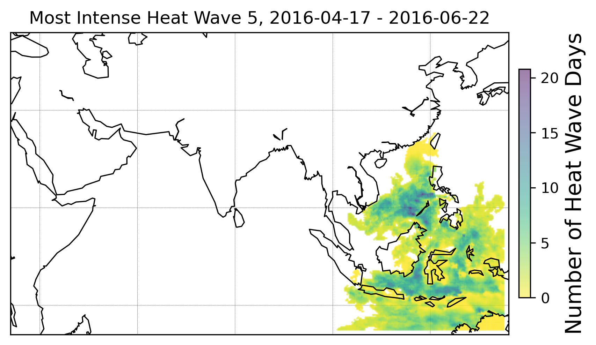
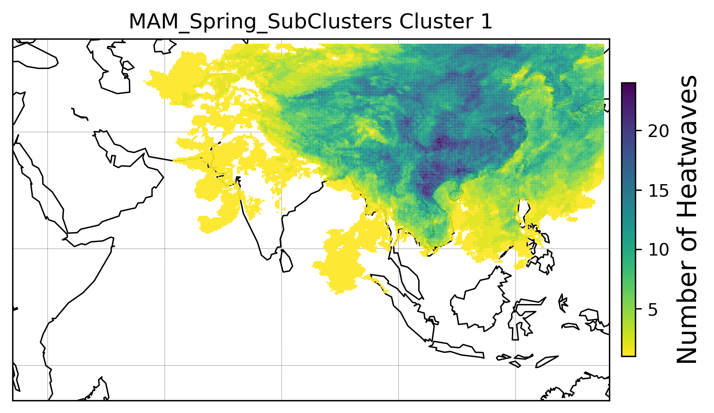

# 🌡️🔥 Spatio-Temporal Heatwave Analysis & Clustering

<p align="center">
  
  
  
</p>

<p align="center">
  <b>🌍 Cutting-edge analysis of extreme heatwaves across Asia-Pacific using high-resolution ERA5 data, advanced clustering, and interactive visualizations.</b>
</p>

<p align="center">
  <b>📄 For a full technical deep-dive, see <a href="Final_Report_Semester_Project.pdf">Final_Report_Semester_Project.pdf</a></b>
</p>

---

## 🗺️ Data Region & Coverage

**Spatial Bounds:**

- **East:** 135°E
- **West:** 35°E
- **North:** 45°N
- **South:** 15°S

This project focuses on the Asia-Pacific region, leveraging daily ERA5 reanalysis data at **0.1° x 0.1°** resolution for maximum spatial detail.

---

---

## 🚀 Project Highlights

- **High-Resolution ERA5 Data**: Daily max temperature, **0.1° x 0.1°** grid (Asia-Pacific, E=135, W=35, N=45, S=-15)
- **Automated Data Download**: ERA5 data fetched via CDS API and custom Python scripts
- **SLURM-Enabled Processing**: Large-scale data handled efficiently with SLURM batch scripts (`data/download_era5_serial.slurm`)
- **Comprehensive Clustering**: Discover **4 major heatwave families** and subfamilies using K-Means & UPGMA
- **Seasonal Insights**: Analyze heatwaves by meteorological seasons (**DJF, MAM, JJA, SON**)
- **Advanced Analysis**: Explore event durations, magnitudes, spatial extents, and more
- **Interactive Visualizations**: Publication-ready plots for every step
- **Full Technical Report**: See [`Final_Report_Semester_Project.pdf`](Final_Report_Semester_Project.pdf) for methodology, results, and discussion

---

---

## � Core Directory Structure

```
Spito-Temporal_Heatwave_Analysis-main/
├── code/
│   ├── Heatwave_Detection.py         # Detects heatwave events from ERA5 data
│   ├── clustering_step1.py           # K-Means clustering (families)
│   ├── clustering_step2.py           # UPGMA clustering (subfamilies)
│   ├── cluster_analysis.py           # Advanced cluster analysis
│   ├── plotting_results.py           # Visualization utilities
│   ├── plotting.py                   # Core plotting functions
│   ├── con_sep.py, cppv.py, extr.py  # Utilities and connectors
│   ├── analysis_heatwaves.ipynb      # Jupyter notebook for interactive analysis
│   └── ...
├── data/
│   ├── api.py                        # Automated ERA5 data download (CDS API)
│   ├── download_era5_serial.slurm    # SLURM batch script for ERA5 download
│   └── era5_t2m_dailymax_*.nc        # ERA5 daily max temperature files
├── results/
│   ├── clustering_step1/             # Family clustering results & plots
│   ├── clustering_step2/             # Subfamily clustering results & plots
│   ├── Advanced_Analysis/            # Comprehensive analysis plots
│   └── ...
├── environment.yml                   # Conda environment file
├── readme.md                         # Project documentation
├── Final_Report_Semester_Project.pdf # Full technical report
└── Data_manipul.ipynb                # Data manipulation notebook
```

---

## 📊 Example Plots & Visualizations

### 🔥 Top 9 HWMID Heatwaves (Over 40 Years)

| Plot Name              | Description     | Image                                                 |
| ---------------------- | --------------- | ----------------------------------------------------- |
| HWMID Intensity Grid 1 | Top Heatwave #1 |  |
| HWMID Intensity Grid 2 | Top Heatwave #2 |  |
| HWMID Intensity Grid 3 | Top Heatwave #3 |  |
| HWMID Intensity Grid 4 | Top Heatwave #4 |  |
| HWMID Intensity Grid 5 | Top Heatwave #5 |  |
| HWMID Intensity Grid 6 | Top Heatwave #6 |  |
| HWMID Intensity Grid 7 | Top Heatwave #7 |  |
| HWMID Intensity Grid 8 | Top Heatwave #8 |  |
| HWMID Intensity Grid 9 | Top Heatwave #9 |  |

### 💥 Most Intense Heatwaves

| Plot Name          | Description           | Image                                             |
| ------------------ | --------------------- | ------------------------------------------------- |
| Intense Heatwave 1 | Most intense event #1 |  |
| Intense Heatwave 2 | Most intense event #2 |  |
| Intense Heatwave 3 | Most intense event #3 |  |
| Intense Heatwave 4 | Most intense event #4 |  |
| Intense Heatwave 5 | Most intense event #5 |  |
| Intense Heatwave 6 | Most intense event #6 |  |
| Intense Heatwave 7 | Most intense event #7 |  |
| Intense Heatwave 8 | Most intense event #8 |  |
| Intense Heatwave 9 | Most intense event #9 |  |

## 🧑‍🔬 Analysis Pipeline

### 1. **Data Acquisition & Preparation**

- Download ERA5 daily maximum temperature data using [`data/api.py`](data/api.py) (CDS API).
- Concatenate and preprocess NetCDF files with `xarray` ([Data_manipul.ipynb](Data_manipul.ipynb)).
- Switch to **0.1° x 0.1°** grid for higher resolution.

### 2. **Heatwave Detection**

- Run [`Heatwave_Detection.py`](code/Heatwave_Detection.py) to identify extreme events.
- Output: CSV files with detected heatwave nodes.

### 3. **Clustering Analysis**

#### K-Means Results

| Plot Name                    | Description                 | Image                                                                            |
| ---------------------------- | --------------------------- | -------------------------------------------------------------------------------- |
| Day of Year Distribution     | Cluster distribution by day |               |
| Dendrogram DJF Winter        | Family dendrogram (DJF)     |                  |
| Dendrogram JJA Summer        | Family dendrogram (JJA)     |                  |
| Dendrogram MAM Spring        | Family dendrogram (MAM)     |                  |
| Dendrogram SON Fall          | Family dendrogram (SON)     |                    |
| Seasonal Analysis DJF Winter | Cluster map (DJF)           |  |
| Seasonal Analysis MAM Spring | Cluster map (MAM)           |  |
| Seasonal Analysis JJA Summer | Cluster map (JJA)           |  |
| Seasonal Analysis SON Fall   | Cluster map (SON)           |    |

#### UPGMA Subfamily Cluster Plots

| Plot Name               | Description              | Image                                                                       |
| ----------------------- | ------------------------ | --------------------------------------------------------------------------- |
| DJF Winter SubCluster 0 | Subfamily cluster DJF #0 |  |
| DJF Winter SubCluster 1 | Subfamily cluster DJF #1 |  |
| DJF Winter SubCluster 2 | Subfamily cluster DJF #2 |  |
| DJF Winter SubCluster 3 | Subfamily cluster DJF #3 |  |
| JJA Summer SubCluster 0 | Subfamily cluster JJA #0 |  |
| JJA Summer SubCluster 1 | Subfamily cluster JJA #1 |  |
| JJA Summer SubCluster 2 | Subfamily cluster JJA #2 |  |
| JJA Summer SubCluster 3 | Subfamily cluster JJA #3 |  |
| JJA Summer SubCluster 4 | Subfamily cluster JJA #4 |  |
| JJA Summer SubCluster 5 | Subfamily cluster JJA #5 |  |
| MAM Spring SubCluster 0 | Subfamily cluster MAM #0 |  |
| MAM Spring SubCluster 1 | Subfamily cluster MAM #1 |  |
| MAM Spring SubCluster 2 | Subfamily cluster MAM #2 |  |
| MAM Spring SubCluster 3 | Subfamily cluster MAM #3 |  |
| MAM Spring SubCluster 4 | Subfamily cluster MAM #4 |  |
| SON Fall SubCluster 0   | Subfamily cluster SON #0 |    |
| SON Fall SubCluster 1   | Subfamily cluster SON #1 |    |
| SON Fall SubCluster 2   | Subfamily cluster SON #2 |    |
| SON Fall SubCluster 3   | Subfamily cluster SON #3 |    |

### 4. **Individual Characteristics**

| Plot Name            | Description                   | Image                                                            |
| -------------------- | ----------------------------- | ---------------------------------------------------------------- |
| Duration Categories  | Heatwave duration categories  |   |
| Magnitude Categories | Heatwave magnitude categories |  |

### 5. **Frequency & Comprehensive Analysis**

| Plot Name                       | Description                       | Image                                                                |
| ------------------------------- | --------------------------------- | -------------------------------------------------------------------- |
| Frequency Statistics            | Heatwave frequency statistics     |              |
| Frequency Comprehensive         | Comprehensive frequency analysis  |  |
| Cross Family/Subfamily Analysis | Cross family/subfamily comparison |     |

### 6. **Family & Advanced Analysis**

| Plot Name                       | Description                   | Image                                                                     |
| ------------------------------- | ----------------------------- | ------------------------------------------------------------------------- |
| Family Comprehensive Comparison | Family comparison             |          |
| Family Duration Distributions   | Family duration distributions |            |
| Family Duration-Magnitude       | Duration vs magnitude         |  |
| Family Duration Violins         | Duration violin plots         |                  |
| Family Radar Comparison         | Radar comparison              |                  |
| Family Seasonal Comparison      | Seasonal comparison           |               |
| Family Yearly Comparison        | Yearly comparison             |                 |
| Raw Extreme Analysis            | Raw extreme analysis          |                     |
| Raw Temporal Analysis           | Raw temporal analysis         |                    |
| Comprehensive Family Analysis   | Advanced family analysis      |           |

### 4. **Seasonal Analysis**

- Assigns each event to a meteorological season (DJF, MAM, JJA, SON).
- Generates seasonal cluster plots and statistics.

### 5. **Advanced Analysis & Visualization**

- [`cluster_analysis.py`](code/cluster_analysis.py): In-depth cluster statistics.
- [`plotting_results.py`](code/plotting_results.py): Generates all visualizations.
- [`analysis_heatwaves.ipynb`](code/analysis_heatwaves.ipynb): Interactive exploration.

---

## 🛠️ How to Run

### 1. **Setup Environment**

```bash
conda env create -f environment.yml
conda activate fr
```

### 2. **Download ERA5 Data**

- Configure CDS API in [`data/api.py`](data/api.py).
- Run the script to download all years.

### 3. **Preprocess Data**

- Use [Data_manipul.ipynb](Data_manipul.ipynb) to concatenate and inspect NetCDF files.

### 4. **Detect Heatwaves**

```bash
python code/Heatwave_Detection.py
```

### 5. **Cluster Events**

```bash
python code/clustering_step1.py -d data/heatwave_nodes.csv -k 4
python code/clustering_step2.py -d data/heatwave_nodes.csv -u 5 -i 1
```

### 6. **Analyze & Visualize**

```bash
python code/cluster_analysis.py -d data/heatwave_nodes.csv -k 4
python code/plotting_results.py -d data/heatwave_nodes.csv -cpv data/supernodes.csv -n 5 -b magnitude
```

---

## 📑 Input Data Requirements

- **ERA5 NetCDF files**: Daily max temperature, 0.1° x 0.1° grid.
- **Heatwave Nodes CSV**: Columns: `cp`, `time`, `latitude`, `longitude`, `magnitude`, etc.
- **Supernodes Table**: Columns: `cp`, `time_amin`, `time_amax`, `HWMId_magnitude`, etc.

---

## 📁 Output Files

- **Detected Events**: CSVs of heatwave nodes.
- **Clustering Results**: Cluster labels, dendrograms, seasonal distributions.
- **Plots**: PNGs of all visualizations (see `/results/`).

---

## 🧩 Dependencies

- `deepgraph==0.2.4`
- `matplotlib==3.5.3`
- `numpy==1.22.0`
- `pandas==1.3.5`
- `basemap==1.3.2`
- `scikit-learn==1.0.2`
- `xarray`, `cdsapi`, `glob`, etc.

---

## 🆘 Troubleshooting

- **Missing Dependencies**:  
  `conda activate fr`
- **Basemap Issues**:  
  `conda install -c conda-forge basemap`
- **File Not Found**:  
  Ensure input files are in `/data/` and paths are correct.
- **Visualization Errors**:  
  Check output directory exists: `mkdir -p /path/to/output/directory`

---

## 📬 Contact & Collaboration

For questions, feedback, or collaboration:

- **Ayush Raj**  
  📧 Email: artamta47@gmail.com

---

> _Ready to explore? Dive into the code, check out the plots, and see the full technical report for all the details!_
